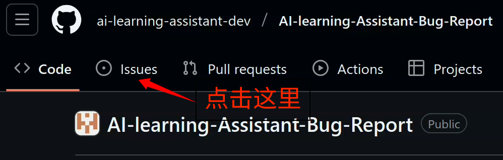

# GitHub界面操作实战指南

这是一份专为从未使用过GitHub的新手准备的详细操作指南。我们将手把手教你如何在GitHub网站上提交你的第一个Issue。

## 🎯 开始之前

确保你已经：

- 注册了GitHub账号
- 能够正常访问GitHub网站
- 找到了你想要贡献的开源项目

## 📍 第一步：找到Issues入口

### 操作步骤

1. **打开项目主页**
   - 在浏览器中输入项目的GitHub地址，例如：`https://github.com/ai-learning-assistant-dev/AI-learning-Assistant-Bug-Report`
   - 你会看到项目的代码仓库主页

2. **定位Issues标签页**
   - 在页面顶部，项目名称下方有一排导航标签
   - 从左到右你会看到：`Code`、`Issues`、`Pull requests` 等
   - **点击 `Issues` 标签页**
     

> [!TIP]
> 如果你看不到`Issues`标签，说明这个项目可能禁用了Issues功能，你需要联系项目维护者。

## 🔍 第二步：搜索现有Issues

在提交新Issue前，**必须先搜索**是否已有相似的问题。

### 操作步骤

1. **进入Issues页面后**，你会看到页面顶部有一个搜索框
   
2. **搜索框的默认内容**通常是 is:`issue` state:`open`，这表示搜索内容是`issue`，并且该`issue`尚未解决
3. **在搜索框中输入关键词**，关键词之间用空格隔开，例如：
   - `登录失败`
   - `无法显示图片`
   - `安装错误`
   - `chrome 浏览器`

> [!TIP]
> 尚未解决的issue用open来表示，而已经解决的issue用close来表示

### 搜索技巧

- **使用具体的关键词**：不要只搜索"bug"或"问题"
- **查看所有的Issues**：在搜索框中state:`open`删掉再去搜索，会得到所有相关的Issue，无论该Issue是否已经被解决

## ➕ 第三步：创建新Issue

如果确认没有重复的Issue，那就需要用户主动创建新的Issue。

### 操作步骤

1. **点击绿色的"New issue"按钮**
   - 这个按钮通常在Issues页面的右上角
   - 按钮颜色是GitHub的绿色主题色
     

2. **选择Issue模板**
   - 一些项目会提供预设的模板选择页面
   - 常见的模板类型：
     - `🐛 Bug report` - 报告软件错误
     - `✨ Feature request` - 请求新功能
     - `📖 Documentation` - 文档相关
     - `❓ Question` - 提问求助
   - **选择最符合你情况的模板**，就会进入内容填写阶段
     
3. **如果没有模板**
   - 直接进入Issue编辑页面

> [!TIP]
> 如果有模板但没有合适的模板，可以使用Blank Issue，这在所有带模板的仓库中都是自带的空Issue模板

## ✍️ 第四步：填写Issue内容

这是最重要的一步！一个好的Issue能大大提高问题被解决的可能性。

### 页面布局说明

Issue编辑页面分为几个主要区域：


> [!TIP]
> 特殊Issue功能对于绝大多数Issue提交者来说都是不需要关心的，它主要是维护项目的管理者要考虑的内容

### 填写标题

**好的标题特征：**

- 简洁明了，一句话概括问题
- 包含关键信息
- 避免过于宽泛的词语

**标题示例：**

- ✅ "Chrome浏览器中登录按钮无响应"
- ✅ "上传大于10MB的文件时报错"
- ✅ "希望添加深色主题功能"
- ❌ "有BUG"
- ❌ "为啥启动器跑不起来？"
- ❌ "到底是怎么回事？我电脑好的啊？"

**基本结构：**

1. **问题描述**：清楚说明遇到的问题
2. **重现步骤**：详细的操作步骤
3. **期望结果**：你认为应该发生什么
4. **实际结果**：实际发生了什么
5. **环境信息**：操作系统、软件版本等

## 📝 Markdown基础语法

GitHub Issue支持Markdown语法，掌握基础语法能让你的Issue更清晰易读。

### 常用语法速查表

| 语法         | 效果      | 用途     |
| ------------ | --------- | -------- |
| `# 标题`     | # 大标题  | 主要标题 |
| `## 标题`    | ## 中标题 | 小节标题 |
| `**粗体**`   | **粗体**  | 强调重点 |
| `*斜体*`     | _斜体_    | 轻微强调 |
| `` `代码` `` | `代码`    | 行内代码 |
| `- 列表项`   | • 列表项  | 无序列表 |
| `1. 列表项`  | 1. 列表项 | 有序列表 |

### 代码块

当你需要贴代码或错误信息时：

````
```
你的代码或错误信息
放在这里
```
````

**指定编程语言（可选）：**

当指定了编程语言后，渲染出来的效果就会带上语法高亮，变得更加美观

````
```javascript
console.log("Hello World");
```
````

### 插入图片

Markdown中插入图片的语法是\!\[图片描述\]\(图片地址\)，但是GitHub中编辑的Markdown可以用更加便捷的方式插入图片：

1. **直接拖拽**：将截图直接拖到编辑框中
2. **复制粘贴**：截图后直接Ctrl+V粘贴
3. **手动上传**：点击编辑框下方的"选择文件"

### 提及用户

在GitHub中写的Markdown可以使用 `@用户名` 通知特定用户：

```
@maintainer 请帮忙看看这个问题
```

### 引用其他Issue

在GitHub中写的Markdown可以使用 `#Issue号码` 引用其他Issue：

```
这个问题可能和 #123 相关
```

## 👀 第五步：预览和检查

在提交前，务必预览你的内容！

### 操作步骤

1. **点击"Preview"标签页**
   - 在每一个编辑框顶部，"Write"旁边有"Preview"用于预览
2. **仔细检查格式**
   - 标题是否清晰
   - 内容是否易读
   - 代码块是否正确显示
   - 图片是否正常加载
3. **检查内容完整性**
   - 是否包含了所有必要信息
   - 重现步骤是否清晰
   - 环境信息是否准确

### 常见格式问题

- **代码没有格式化**：确保使用了代码块语法
- **列表没有正确显示**：检查`-`或`1.`后面是否有空格
- **图片无法显示**：重新上传图片

## 🚀 第六步：提交Issue

确认无误后，就可以提交了！

### 操作步骤

1. **最后检查**
   - 标题是否准确
   - 内容是否完整
   - 格式是否正确

2. **点击"Create"按钮**
   - 这是一个绿色的按钮
   - 通常在编辑框的左下角
     

3. **提交成功后**
   - 页面会跳转到你刚创建的Issue页面
   - 你会看到Issue号码（如#124）
   - 系统会自动发送通知给项目维护者

> [!TIP]
> 如果你在创建完Issue后发现还存在有待修改的内容，也可以点击右侧按钮弹出弹窗选择修改
> 

## 📬 第七步：提交后的跟进

提交Issue只是开始，后续的互动同样重要。

### 关注通知

1. **邮件通知**
   - GitHub会发送邮件通知到你的注册邮箱
   - 包括新回复、状态变更等

2. **网站通知**
   - GitHub右上角有三个通知图标，三个通知图标分别表示：Issues、Pull Requests、Notifications
     
   - 点击Issues图标，可以查看所有与你相关的Issues

### 回复互动

当维护者或其他用户回复时：

1. **及时回复**
   - 如果有人询问更多信息，尽快提供
   - 补充截图或详细描述

2. **提供测试反馈**
   - 如果维护者提供了解决方案，及时测试并反馈结果

### 如何回复

在Issue页面底部有评论框：


### 关闭Issue

当问题解决后：

1. **由维护者关闭**：通常情况下，维护者找到解决方法后会关闭Issue
2. **自己关闭**：如果问题自己解决了，可以点击"Close issue"按钮

### Issue状态

- **Open（开放）**：问题还未解决
- **Closed（已关闭）**：问题已解决或不会处理

## ⚠️ 常见错误和注意事项

### 新手常犯的错误

1. **重复提交**：没有搜索就直接创建新Issue
2. **信息不足**：只说"有问题"不说具体是什么问题
3. **格式混乱**：不使用Markdown格式，代码直接贴在正文中
4. **环境信息缺失**：不提供操作系统、软件版本等关键信息
5. **标题过于宽泛**：使用"bug"、"求助"等无具体意义的标题

### 如何避免这些错误

- **仔细阅读项目的贡献指南**
- **使用我们提供的模板**
- **提交前预览内容**
- **多提供细节总比少了好**
